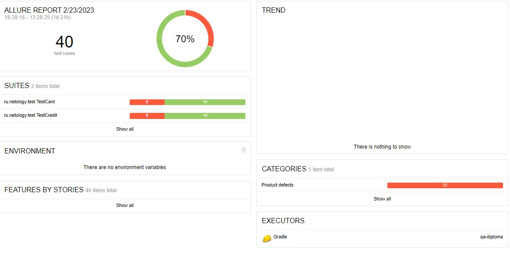

## Отчет по итогам автоматизированного тестирования
___

### Задача проекта:
Провести тестирование функциональности сервиса "Путешествие дня" для покупки туров по карте или в кредит (данный сервис взаимодействует с СУБД и API Банка).

Сервис был протестирован в соответствии с планом автоматизации тестирования [Plan.md](https://github.com/OlgaKusakina/qa-diploma/blob/main/Plan.md)

Тестирование проведено для двух БД:
- MySQL  
- PostgreSQL

### Количество тест-кейсов

**Всего:** 40 тест-кейсов
- Успешных: 28 тест-кейсов - 70%
- Неуспешных: 12 тест-кейсов - 30%

Отчет о тестировании Allure:

При подключении к БД MySQL:

При подключении к БД PostgreSQL:

На все выявленные ошибки были заведены репорты в [Issues](https://github.com/OlgaKusakina/qa-diploma/issues)

### Общие рекомендации

1. Исправить визуальные и орфографические ошибки, заведенные в репорты [Issues](https://github.com/OlgaKusakina/qa-diploma/issues)
2. Кнопки "купить" и "купить в кредит" сделать одинаковым цетом чтобы при нажатии на одну из кнопок (раздел выделялся другим цветом) и было понятно, где именно находишься
3. Проверить настройки валидации полей, исправить подсказки для пользователей (например, если поле не заполнено - сообщение "Поле обязательно для заполнения")

